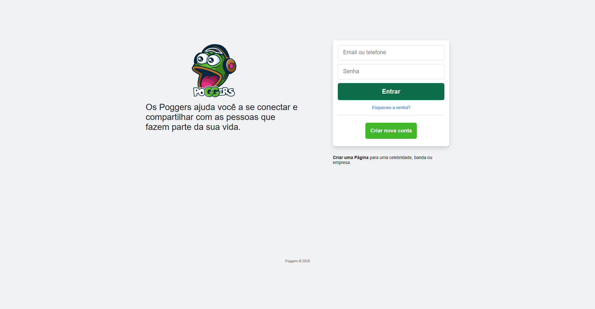

# 🐸 FacePoogers


> Um clone divertido e responsivo da página de login do Facebook, feito para praticar desenvolvimento frontend.




## 📖 Sobre o Projeto

O **FacePoogers** é um projeto de estudo que recria a interface de login do Facebook utilizando apenas HTML, CSS e JavaScript puro (Vanilla JS). 

O foco do projeto é praticar:
- Estruturação semântica com HTML5
- Layout responsivo com Flexbox e CSS Grid
- Estilização avançada com CSS3
- Manipulação do DOM com JavaScript

## ✨ Funcionalidades

- 📱 **Totalmente Responsivo** – adapta-se perfeitamente a celulares, tablets e desktops
- 🎨 **Fidelidade visual** – cores, tipografia e espaçamentos próximos do Facebook original
- 🔐 **Simulação de Login** – credenciais de teste: `admin` / `admin`
- 🐸 **Identidade customizada** – tema "Poggers" com logo e elementos divertidos

## 📋 Pré-requisitos

- Um navegador web moderno (Chrome, Firefox, Edge, Safari)
- (Opcional) Editor de código como [VS Code](https://code.visualstudio.com/) com a extensão **Live Server**

## 🚀 Como Executar

```bash
# Clone o repositório
git clone https://github.com/renanratinh0/FacePoogers.git

# Entre na pasta do projeto
cd FacePoogers
```

Depois basta abrir o arquivo `index.html` no navegador ou usar a extensão **Live Server** do VS Code.

## 📂 Estrutura de Pastas

```plaintext
FacePoogers/
├── IMG/
│   ├── icon.png          # Favicon
│   └── poggers.png       # Logo principal
├── index.html            # Página principal
├── style.css             # Estilos e responsividade
├── img.png               # Screenshot do projeto
├── LICENSE
└── README.md
```

## 💻 Tecnologias Utilizadas

- **HTML5** – Estrutura semântica
- **CSS3** – Flexbox, Grid, variáveis, media queries e efeitos visuais
- **JavaScript (Vanilla)** – Validação de formulário e simulação de autenticação

## 🤝 Como Contribuir

Contribuições são muito bem-vindas!

1. Faça um **fork** do projeto
2. Crie uma branch para sua feature:
   ```bash
   git checkout -b feature/minha-melhoria
   ```
3. Faça o commit das alterações:
   ```bash
   git commit -m 'feat: adiciona nova funcionalidade'
   ```
4. Envie para a branch:
   ```bash
   git push origin feature/minha-melhoria
   ```
5. Abra um **Pull Request**

## 📝 Licença

Este projeto está sob a licença **MIT License** — veja o arquivo [LICENSE](LICENSE) para mais detalhes.

---

**Desenvolvido por renanratinh0** © 2026
```